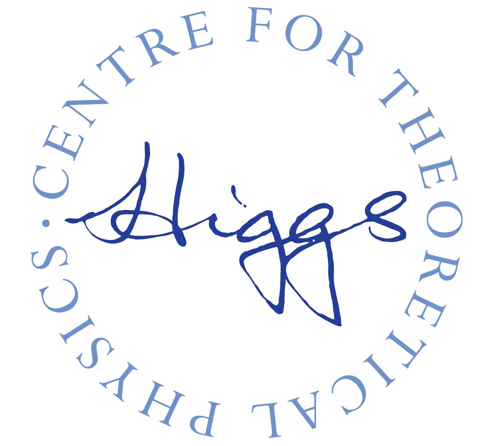
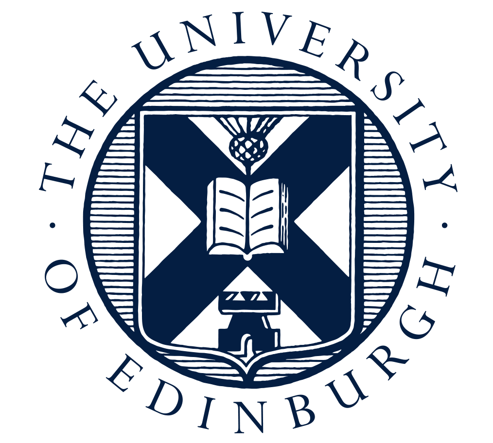

# Can you find the Higgs boson? 

## Challenge

The ATLAS Collaboration released collision data to the general public. The currently available amount of data is up to 10/fb, about 10-times more than available for the Higgs boson observation in 2012. The challenge is: can you find the Higgs boson in this data?

## Methodology

This project tackles the challenge in Higgs decays to photons, using dataset [1] and machine learning techniques. 

[1] ATLAS Collaboration (2020). ATLAS 13 TeV samples collection Gamma-Gamma, for 2020 Open Data release. [CERN Open Data Portal](https://opendata.cern.ch/record/15006). 

The code and information is organised as follows:
1. [NtupleProcessing](https://github.com/FindTheHiggs/NtupleProcessing): converts Open Data files from CERN ROOT format to .csv format, which can be used as input to machine learning algorithms (or viewed in a text editor). 
2. [Code](https://github.com/FindTheHiggs/Code): 1st version of solving the challenge. A worked-out jupyter notebook, reading in .csv and performing Higgs search using a BDT. 
3. [BDTScript](https://github.com/FindTheHiggs/BDTScript): 2nd version of solving the challenge, WIP. 

## Sponsors 

     
     

